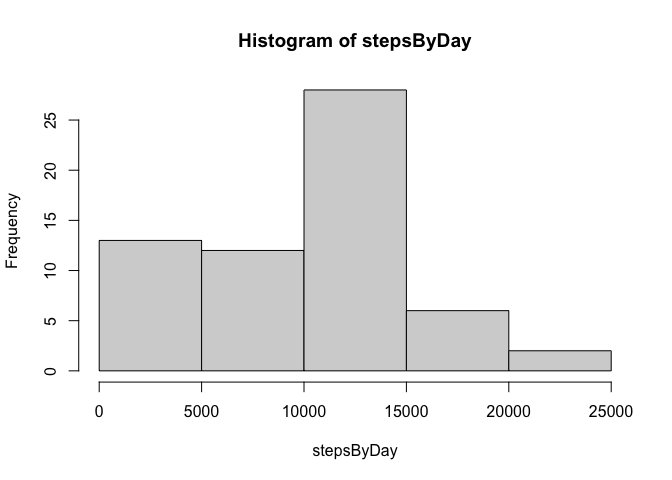
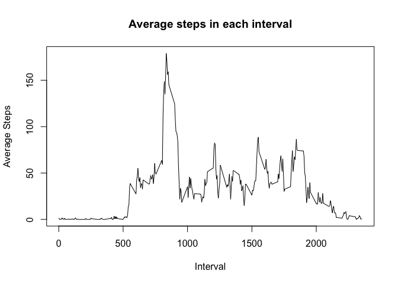
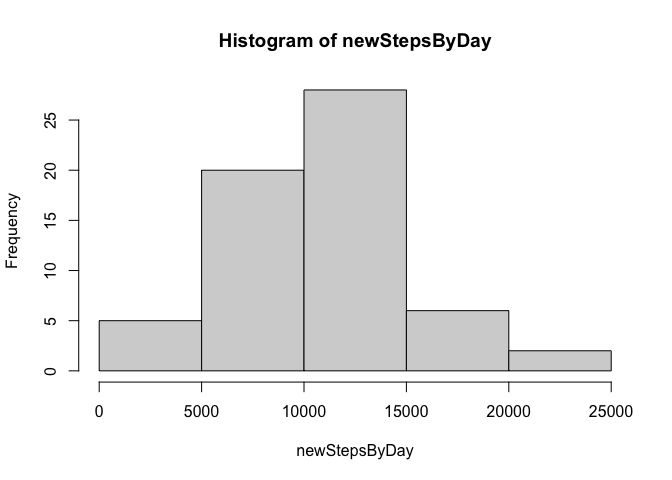

## Loading and preprocessing the data

First, we load the package ```readr```, unzip the data file and read it into 
the variable ```activity```

```r
#install.packages("readr")
library(readr)
setwd(getwd())
unzip("activity.zip")
activity <- read.csv("activity.csv", header = TRUE, na.strings = "NA")
```

Then, we convert the dates variable to the Date class

```r
activity$date <- as.Date(activity$date)
```

## What is mean total number of steps taken per day?

Remove NA values for this question and make a histogram

```r
activity$nSteps <- ifelse(is.na(activity$steps), 0, activity$steps)
stepsByDay <- with(activity, tapply(nSteps, date, sum))
hist(stepsByDay)
```

<!-- -->

Calculating the mean of the total steps per day

```r
mean(stepsByDay)
```

```
## [1] 9354.23
```

and the median

```r
median(stepsByDay)
```

```
## [1] 10395
```

## What is the average daily activity pattern?

Calculate the average step per interval

```r
stepsByDay <- with(activity, tapply(nSteps, interval, mean))
plot(stepsByDay ~ as.numeric(names(stepsByDay)), type = "l", 
     xlab = "Interval", ylab = "Average Steps", main = "Average steps in each interval")
```

<!-- -->

To find which 5-minute interval, on average, contains the maximum 
number of steps,

```r
names(which.max(stepsByDay))
```

```
## [1] "835"
```

## Imputing missing values

Calculating the total number of missing values

```r
sum(is.na(activity$steps))
```

```
## [1] 2304
```

Creating a new dataset and substituting missing values with the 5-min average
over all days

```r
avgActivity <- activity
avgActivity$nSteps <- ifelse(is.na(avgActivity$steps), 
                             stepsByDay[as.character(avgActivity$interval)],
                             avgActivity$steps)
```

Making a histogram of the total number of steps taken each day

```r
newStepsByDay <- with(avgActivity, tapply(nSteps, date, sum))
hist(newStepsByDay)
```

<!-- -->

Calculating the new mean of the total steps taken per day

```r
mean(newStepsByDay)
```

```
## [1] 10581.01
```

and the median

```r
median(newStepsByDay)
```

```
## [1] 10395
```

As we can see, imputting missing data drastically increased the estimates of the
total daily number of steps.

## Are there differences in activity patterns between weekdays and weekends?
